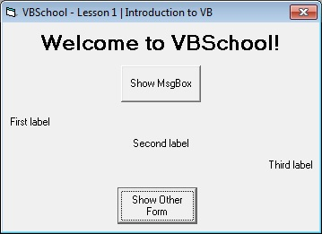



## VBSchool \- Lesson 1

### Description

Welcome to <b>VBSchool</b>, course of VB. It will teach you programming in Visual Basic 6.

<u>Lesson 1</u>

Basic introduction to VB - Forms and Controls, simple MsgBox.

My first submission here. I know it is very basic, but I think it's a good start for a 13 years old!
 
### More Info
 

             |
---                |---
**Submitted On**   |2012-04-03 11:55:50
**By**             |[IXCon Design](https://github.com/Planet-Source-Code/PSCIndex/blob/master/ByAuthor/ixcon-design.md)
**Level**          |Beginner
**User Rating**    |5.0 (10 globes from 2 users)
**Compatibility**  |VB 6\.0
**Category**       |[Coding Standards](https://github.com/Planet-Source-Code/PSCIndex/blob/master/ByCategory/coding-standards__1-43.md)
**World**          |[Visual Basic](https://github.com/Planet-Source-Code/PSCIndex/blob/master/ByWorld/visual-basic.md)
**Archive File**   |[VBSchool\_\-222243432012\.zip](https://github.com/Planet-Source-Code/ixcon-design-vbschool-lesson-1__1-74322/archive/master.zip)

